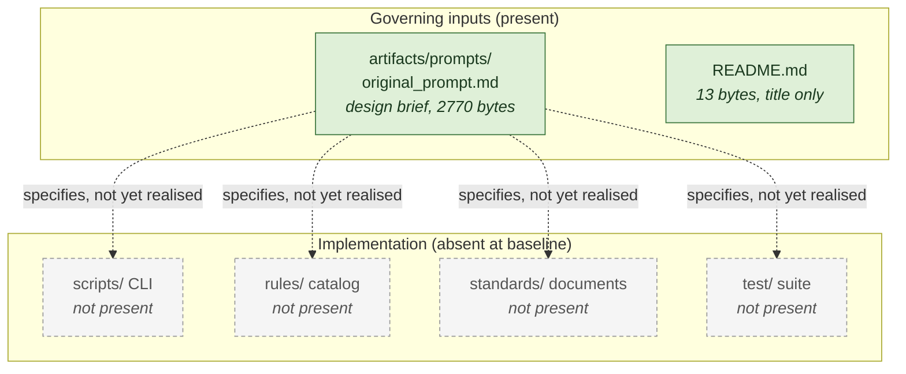

# Architecture — AIStandards

> **PRE-IMPLEMENTATION BASELINE.** Captured 2026-09-03, before any Phase 1 work.
>
> This document is **post-reconstruction evidence about the repository at this moment**. It is not
> evidence of pre-existing intent, and nothing in it should be read as describing what anyone
> historically planned. It records what the repository contained when the baseline was taken, and
> nothing more.
>
> **There is no architecture yet.** This document says so rather than inferring one. It will be
> regenerated once an implementation exists; see [Status](#status).

## Status

| Question | Answer at baseline |
|---|---|
| Does an implementation exist? | **No.** |
| Source files | None |
| Build | None. No `package.json`, no manifest of any kind |
| Dependencies | None declared |
| Tests | None |
| CI | None |
| Deployment | None |
| Runtime processes | **None.** There is nothing to run |
| Background jobs | **None.** Confirmed by absence of any source file |
| API endpoints | **None** |
| Database | **None** |
| External integrations | **None** |

## Repository contents

Complete, not a sample — the repository has two files.

| Path | Size | What it is |
|---|---|---|
| `README.md` | 13 bytes | The literal text `# AIStandards`. A title and nothing else |
| `artifacts/prompts/original_prompt.md` | 2 770 bytes | The design brief. Governing input; not to be edited |

Git state at baseline: one commit, `18097f6 Initial commit`, containing `README.md` only. Branch
`develop`. Remote `https://github.com/mikeycdavis/AIStandards.git`. `artifacts/` was untracked at the
time this baseline was taken.

## What the brief asks for

Summarised from `artifacts/prompts/original_prompt.md`, which remains the authority. This section
describes a **specification, not an implementation** — none of it exists yet.

The brief asks for practical, machine-checkable AI engineering standards modelled on the existing
EngineeringStandards repository, covering ten subject areas: AI safety and human oversight; data
privacy, provenance, consent, retention and access control; model evaluation, benchmark integrity,
robustness and regression testing; prompt, tool, agent and retrieval security; hallucination,
uncertainty, citation and capability honesty; reproducibility, versioning, lineage and rollback;
observability, incident response, red teaming and auditability; accessibility, fairness,
transparency and user disclosure; cost, latency, environmental impact and operational resilience;
and approval gates for high-impact, destructive, autonomous or externally visible actions.

Each standard must state nine things: scope and applicability; normative requirements using
MUST/MUST NOT/SHOULD/MAY; rationale and failure modes; evidence required; validation type
(automated, manual-review, or not-evaluable); severity and non-exemptibility; minimum tests and
falsifiers; exceptions, attestations, expiry and staleness rules; and related standards and ADRs.

It also asks for a versioned machine-readable policy schema, a policy file, an `audit` command for
evidence discovery, a `validate` command for policy-aware verdicts, a six-way distinction between
passed / failed / warning / skipped / not-evaluated / prohibited-but-unestablished, six template
families, local and containerized CI with pinned dependencies, tests for every detector including
negative controls and mutation tests, and documentation covering adoption, reconstruction,
governance, review ownership and release criteria.

The brief closes with two constraints that govern this repository's construction: do not invent
historical intent, test results, approvals, reviewers, model capabilities or compliance evidence;
and never weaken a test, policy, standard or evidence requirement merely to make a gate pass.

## Diagram

The only honest diagram at baseline shows what is present against what the brief specifies but which
does not yet exist. Dashed edges are specification, not realisation.

`docs/architecture-baseline-2026-09-03.mmd` is the canonical source; the block above is byte-identical to it. No `.svg`
was rendered — `npx @mermaid-js/mermaid-cli` was not run, because a diagram of an empty repository
does not warrant a network fetch and the embedded block renders natively. A hand-drawn substitute was
not created, and must not be.

No `sequenceDiagram` is included. There is no request flow to describe, and inventing one would be
exactly the fabrication the brief prohibits.

## Gaps and ambiguities

None arising from unclear code, because there is no code. The genuine unknowns at baseline are
recorded in the plan rather than here, and concern the enforcement contract with StandardsEnforcer
rather than this repository's own contents.

## Regeneration

**Regenerate this document; do not hand-patch it.** It is expected to be materially wrong the moment
Phase 1 lands, because Phase 1 creates the first architecture this repository has ever had. The
plan schedules a second `/codebase-docs` run at the end of Phase 5, against an architecture that
actually exists.

Two runs, two labels. This one records that nothing pre-existed. The next one records what was built.
Neither is evidence about the other.
