# Architecture — AIStandards

> AIStandards is a standards pack: a corpus of numbered, normative AI engineering standards, plus a
> zero-dependency Node CLI that reads a *target* repository and reports what it can and cannot
> establish about that repository's conformance. It is used by engineers adopting the standards in
> their own repositories, and — from Phase 7 — by StandardsEnforcer, which runs the CLI and reads
> the top-level `status` key of its JSON. Its defining design constraint is negative: no mechanism
> in it may convert absent evidence into a pass.

**Provenance of this document.** Generated by the `codebase-docs` skill on 2026-09-14 against the
tree integrated for the Q13 correction and Standard 23 (`git log --grep "Q13"`), by reading the files
it names. It describes the implementation at that commit — 14 modules, 13 of 53 standards, 46 of a
planned ~96 rules in 8 shards. It replaces the regeneration of earlier the same day against the tree
committed with Standard 09, which predated two behaviour changes: the safety detector now searches a
file with its comments blanked in place, and a clean result from a partial-assurance rule is no longer
`passed`. It is **not** a plan and does not describe Phases 3–7. The superseded pre-implementation
capture is preserved separately as `docs/architecture-baseline-2026-09-03.md`, which must not be
overwritten: it is the evidence that nothing pre-existed the build.

Two statements in the previous regeneration are not carried forward because the code changed under
them: that `evaluateRule()` reports every observation with neither a violation nor an unknown as
`passed`, and that a detector's blind spot therefore reports `passed`. Both now hold only for rules
declaring `assurance: full`.

`docs/architecture.mmd` and `docs/validate-flow.mmd` are the canonical diagram sources. The fenced
blocks below are byte-identical copies. Regenerate this document rather than hand-patching it.

---

## Tech Stack

| Layer | Technology |
|---|---|
| Runtime | Node.js ≥ 18 declared (`engines` in `package.json`), ESM `.mjs` throughout. Which versions have executed which tree is recorded per commit in `docs/HANDOFF.md` §3; no version outside that record has been run |
| Dependencies | **None.** No `dependencies` key, no `devDependencies`, no lockfile — structurally enforced by `test/no-phase-creep.test.mjs` |
| Test framework | `node:test` + `node:assert/strict`, run via `scripts/test.mjs` with an explicit list of 21 files |
| YAML | `scripts/yaml.mjs` — a hand-written subset parser that *refuses* constructs it cannot represent rather than guessing |
| JSON Schema | `scripts/jsonschema.mjs` — a hand-written Draft-07 subset validator |
| Normative corpus | Markdown (`standards/`), JSON rule shards (`rules/`), JSON Schema (`schemas/`) |
| Distribution | `bin` entry `standards` → `scripts/standards.mjs` |

The zero-dependency rule is not a preference. A standards pack that installs code from a registry
during its own CI cannot claim to have verified committed content, and a lockfile would make that
failure quiet. Its absence is asserted by a test, so adding one breaks the build.

## Runtime Processes

There is one product process. AIStandards has no server, no daemon, and no background work.

### `standards` CLI
**Host:** invoked directly by a developer, by `npm run` scripts, by CI, or by StandardsEnforcer as a
subprocess.
**Entry point:** `scripts/standards.mjs` (753 lines); `main(argv)` at line 703, dispatched from the
`import.meta.url` guard at the foot of the file.
**Purpose:** Walks a target repository, runs a fixed sequence of detectors over it, and emits either
an evidence report (`audit`) or a policy-aware verdict (`validate`). It reads the target's own
`ai-policy.yml`; it never falls back to this checkout's policy.

Five further executables are gates or corpus tooling rather than products, each with its own `main`
and exit codes: `scripts/fidelity.mjs` (94 lines), `scripts/inventory.mjs` (385),
`scripts/standards-sections.mjs` (533), `scripts/sync-rule-tables.mjs` (450) and `scripts/test.mjs` (87).
Only `sync-rule-tables.mjs` has a write path, and it writes only inside generated blocks.

## Background Jobs

**None.** There are no schedulers, workers, queues, pollers, or cron definitions anywhere in the
repository. Every code path in AIStandards runs synchronously inside one CLI invocation and exits.

## Commands

AIStandards exposes no HTTP surface. Its public interface is the CLI, and this section is the
equivalent of an endpoint inventory. `package.json` wraps each as an npm script: `test`, `audit`,
`validate`, `fidelity`, `inventory`, `catalog-sync`, `catalog-sync:check`, `sections`.

### `scripts/standards.mjs`
| Command | Flags | Purpose |
|---|---|---|
| `audit <path>` | `--json` | Evidence discovery. Prints the file surface, the detected AI surface, and all findings. Emits **no status and no score**, and prints the literal line `This is evidence, not a verdict.` (`NOT_A_VERDICT`, line 546) |
| `validate <path>` | `--policy=`, `--json` | The policy-aware verdict. Loads the target's `ai-policy.yml`, applies applicability, runs the same detectors, and emits an envelope whose top-level `status` is one of five values. The human form lists every result that is not `passed`, then "Prohibitions not established. These are not passes:", then the not-evaluable rules |

**Exit codes** (`scripts/standards.mjs:32-35`) are process semantics only and are never a verdict:
`0` clean · `1` a project-level failure (`NON_COMPLIANT` or `NOT_EVALUATED`) · `2` a *configuration*
error — missing policy, bad flags, version mismatch · `3` a structural integrity breach
(`BLOCKED_BY_INVARIANT`).

The `2`/`1` split is load-bearing: a broken setup must not be readable as a broken project.

### Gate and corpus scripts
| Command | Exit 0 | Exit 1 | Exit 2 |
|---|---|---|---|
| `node scripts/fidelity.mjs` | every verbatim block matches the brief after the declared CRLF→LF normalization | a block does not match | **zero blocks declared** — a check with nothing to check is a configuration error, not a pass |
| `node scripts/inventory.mjs` | every check that could run passed; checks that could not run are listed as withdrawn, never as passed | a check found a defect | the specification lists no items, or the specification or catalog cannot be read |
| `node scripts/standards-sections.mjs [--root=] [--json]` | every written standard conforms | a finding | bad arguments, missing directories, an unreadable specification, zero documents, or an inconsistent mapping |
| `node scripts/sync-rule-tables.mjs [--root=] [--check]` | in sync, or written | drift found (`--check` only) | malformed input — including a rule cited in no or several requirement sections, and a written standard missing a block for a shard holding its rules — zero blocks, a catalog that does not load, or a bad argument. **Nothing is written when any error exists** |
| `node scripts/test.mjs` | all files passed | a test failed | a listed file is missing, a test file on disk is unlisted, the list is empty, or the runner died |

The zero-work-is-exit-2 rule appears in every one of them, for the same reason each time: an empty run
and a clean run are indistinguishable in stdout, so they must be distinguishable in the exit code.

## Database

**None.** AIStandards has no database, no ORM, no migrations, and no persistent state of any kind.
Every input is a file in the repository or in the target being examined.

## External Integrations

| System | Purpose | How connected |
|---|---|---|
| StandardsEnforcer | Reads AIStandards' verdict for a governed repository | **Not yet connected.** The adapter (`standards-adapter.json`) is Phase 5 and does not exist at this commit. The enforcer would run `validate --json` as a subprocess and parse the top-level `status` key — never the exit code |
| MachineLearningStandards | Owns reproducibility, dataset provenance, evaluation and drift | Referenced by `artifacts/boundary-review.json` and by standards' Scope sections. No code dependency. The planned in-band expression (`boundary.ml-pack-required`) is not implemented |
| Nine adjacent packs, including EngineeringStandards and MathematicsStandards | Rule ids this pack must never reuse | `artifacts/foreign-namespace-inventory.json` records their ids, and `test/namespace.test.mjs` asserts no catalog id collides. Separately, `FOREIGN_NAMESPACES` in `catalog.mjs` refuses the `ai` and `ai-ux` namespaces at load |

There are no network calls anywhere in the codebase. The pack never contacts a model provider, a
registry, or any remote host — including during its own tests.

## Layers & Components

### Entry layer — the CLI
**Responsibility:** argument parsing, the detector sequence, and the two command bodies.

- `scripts/standards.mjs` — the only executable that examines a target. Holds `collectFiles()`
  (line 62, with the `SKIP` map at line 54 — `.git` and `node_modules` as not project evidence,
  `test/fixtures` at the target root as a *framework* exclusion — and a 512 KiB per-file cap in
  `MAX_BYTES`), `readText()` (line 101, returning `{ok, text, truncated}` so a failed read and an empty
  file are distinguishable), `CONTENT_DERIVED_RULES` (line 121), `createRun()` (line 142, the single
  mutable run object with its writers `addFinding`, `observe`, `breakInvariant`), the twelve detectors,
  `checkApplicabilityContradictions()` (line 500), `runDetectors()` (line 518, a fixed commented
  sequence, not a registry), `commandAudit()` (line 548), `commandValidate()` (line 597) and
  `parseArgs()` (line 689). Exports `EVALUATED_RULES` (line 130, nine rule ids — five declaring
  `assurance: full`, four `partial`), `main`, `distinction`, `DISPOSITION`.
- **The twelve detectors.** Descriptive, bound to no rule: `detectManifestPresence` (178),
  `detectToolPermissions` (196), `detectPromptAssets` (209), `detectToolDefinitions` (219). Judgmental,
  full assurance: `detectMissingManifest` (229), `detectInvalidManifest` (241), `detectScaffoldManifest`
  (260), `detectMissingToolPermissions` (278), `detectUndeclaredTool` (300). Judgmental, partial
  assurance: `detectFloatingModelAlias` (344, a maintained list `FLOATING_ALIAS` of moving-alias
  shapes), `detectInlineSystemPrompt` (375) and `detectDisabledSafetyControls` (450).
- **`detectInlineSystemPrompt`** measures a quoted literal of 200+ characters (`INLINE_THRESHOLD`) in three
  detection shapes, each named in its evidence string: the parameter shape (`INSTRUCTION_PARAM`, a listed
  name then `:` or `=`), the message role shape (`messageRoleLength`: an object or YAML mapping whose
  `role` is `system` and whose own `content` is the literal) and the `systemInstruction` parts shape
  (`systemInstructionPartsLength`: a `text` literal inside the `parts` of a `systemInstruction`). All three
  search the `codeOnly` view for keys and measure the literal in the original text. Variables, template
  and concatenated content, typed-part arrays, the `developer` role and keyword-argument constructors are
  not claimed.
- **`detectDisabledSafetyControls`** searches each code or configuration file's text with comments
  blanked in place (`withoutComments` from `splitSource()`), only when the file names a key in
  `SAFETY_KEY`. It fires on a `DISABLED_SAFETY` literal (`BLOCK_NONE`, `OFF`) or on the off-pattern: a
  key in `OFF_KEYS`, `:` or `=`, then `false` (`OFF_FALSE`) or a quoted `none` / `off`
  (`OFF_QUOTED`, or `OFF_QUOTED_YAML` for `.yml`/`.yaml`, which omits the ternary guard). The quoted
  form is guarded against a union-type member (`"off" | "on"`) and, outside YAML, a ternary
  consequent. Unreadable files are skipped without recording an unknown. A shortened walk withdraws
  a clean result only; the collected files are still scanned and a violation in one still fails.
- The walk does not skip `.claude/` or any other untracked directory. Untracked local files present in
  a checkout are part of what `audit` counts and what content-derived detectors read.

### Catalog layer
**Responsibility:** loading the rule shards and refusing a catalog that violates its own invariants.

- `scripts/catalog.mjs` (241 lines) — `loadCatalog()` (line 163) reads `rules/*.json` and throws
  `CatalogError` on any breach found by `checkRule()` (line 79). Owns `RULE_ID` (line 30),
  `VALIDATION_TYPES`, `ASSURANCE` (`full`, `partial`, `none`), `LEVELS`, `SEVERITIES`, the 17-entry
  `NAMESPACES` set (line 43), `FOREIGN_NAMESPACES` (line 50), `SHARED_SEGMENTS` (line 60, six segments
  declared as also used by another pack, `agent` among them), `resolve()` (199), `assertBindings()`
  (line 210) and `coverage()` (line 225). A `not-evaluable` rule must declare assurance `none`, may not
  be attestable or `nonExemptible`, and must carry a substantive `$notEvaluableNote`. A rule's
  `assurance` is a catalog declaration; nothing measures it.

### Policy layer
**Responsibility:** finding, loading and applying the *target's* policy — the pack's single most
security-relevant seam.

- `scripts/policy.mjs` (146 lines) — `resolvePolicyPath()` (line 40) joins `POLICY_BASENAME`
  (`ai-policy.yml`) onto the target directory. **The pack root is never passed in as a fallback
  argument, so there is no code path in which it could be used.** `loadPolicy()` (line 54) validates
  against `schemas/ai-policy.schema.json`; `assertVersionIdentity()` (line 98) refuses a policy pinned
  to a different framework version; `applyPolicy()` (line 116) applies applicability declarations.
  Every failure is `PolicyError` → exit 2.

### Judgment layer
**Responsibility:** turning observations into a verdict, and deriving the six-way distinction.

- `scripts/compliance.mjs` (316 lines) — holds **four separate vocabularies** that are never
  merged: `STATUS` (5 values), `RESULT` (4), `DISPOSITION` (5), `DISTINCTION` (6). `distinction()`
  (line 58) is a **pure derived function** of `(result, disposition, level)` — never stored, so it
  cannot drift from the vocabularies it summarises. Its branch order is load-bearing: the
  `forbidden` branch is tested *before* the general not-evaluated branch, so an unestablished
  prohibition reports as `prohibited-but-unestablished` and never merely as `not-evaluated`.
- `evaluateRule()` (line 90) turns one rule's observations into a result, in this order:
  not-applicable → `skipped / not-applicable`; `not-evaluable` → `skipped / not-evaluated`; outside
  `EVALUATED_RULES` → `skipped / not-evaluated`; any confirmed violation → `failed` (or `warning` for a
  `recommended` level or `warning` severity), carrying only the confirmed evidence; any unknown →
  `skipped / not-evaluated` with the unknown's own message; **a clean result from a rule declaring
  `assurance: partial` → `skipped / not-evaluated`**, with a message saying the check ran over a
  declared partial scope and the detector's own message appended; otherwise `passed`. The partial
  branch is Standard 5 R6's "covered less than the rule requires", added on 2026-09-14 (Q13): a
  narrow clean search no longer counts toward `COMPLIANT` or the score, and it never erases a finding.
- `evaluate()` (line 206) decides the status: invariant violations → `BLOCKED_BY_INVARIANT` with
  `score: null`; required or forbidden failures → `NON_COMPLIANT`; any applicable, not-evaluable-excluded
  rule with disposition `not-evaluated` → `NOT_EVALUATED`; else `COMPLIANT`. The score is passed ÷
  scored, where scored is applicable minus not-evaluable. `assurance.automated` counts results with
  disposition `evaluated` that are not manual-review, so a partial rule counts there only when it
  found a violation. `envelope()` (line 295) builds the emitted report.

### Parser layer — dependency-free
**Responsibility:** reading YAML, validating JSON Schema, and splitting source into use and mention.

- `scripts/yaml.mjs` (244 lines) — `parseYaml()` (line 123). The `REFUSED` list (line 26) names the
  constructs it will not guess at (block scalars among them); it throws `YamlError` rather than
  returning a plausible wrong value.
- `scripts/jsonschema.mjs` (254 lines) — `validate()` (line 78) and `assertValid()` (line 249).
- `scripts/source.mjs` (172 lines) — `splitSource()` (line 58) performs the **USE/MENTION split**,
  selecting comment syntax by extension from `SYNTAX` (line 14) and `BY_EXTENSION` (line 22). It returns
  the `code`, `comments` and `strings` partitions and, since 2026-09-14, `withoutComments`: the whole
  text with every comment replaced by spaces in place, line breaks kept, so code and literals stay where
  they were written. `isCode()` (34) and `extensionOf()` (39) are exported beside it. A file whose
  extension is not listed is not code to the detectors that use it and is never searched by them. This
  is what stops a repository that *discusses* jailbreaks, floating aliases or disabled safety flags in
  prose from being reported as *using* them. `//` is floor division in Python, and the table knows it.
- `scripts/scaffolding.mjs` (73 lines) — `SCAFFOLD_MARKER` (`$scaffold`), `isPlaceholder()` and
  `inspectScaffolding()`. Exists from Phase 1, not retrofitted, so generated placeholder content
  can never satisfy a rule.

### Specification layer
**Responsibility:** parsing the derived specification and the brief, so the review gates can compare
them.

- `scripts/spec.mjs` (206 lines) — `readSpec()`, `readPrompt()`, `readBoundaryReview()` (line 56),
  `verbatimBlocks()` (line 72), `parseSpec()` (line 130), `additionsSection()` (line 199). Owns
  `CLASSES` (`D` derived / `V` verbatim / `A` authored), `POSTURES` (`O`/`B`/`X`/`D`),
  `ADDITIONS_HEADING`, and `normalizeEol` — the **single declared normalization** (CRLF→LF on both
  sides) used for verbatim comparison, with raw-byte matches reported separately.

### Gate and corpus-tooling layer
**Responsibility:** the checks that keep the catalog, the specification and the standard documents in
agreement, and the one tool that writes the documents' generated tables.

- `scripts/fidelity.mjs` — compares every class-V block against the brief. Its header states plainly
  what it *cannot* establish: that the quoted block is the right block, that an unquoted passage is
  honoured, or that any standard written under a block says what the block requires.
- `scripts/inventory.mjs` — seven check functions: `checkNumbering` (42), `checkDerivation` (59),
  `checkAuthoredDeclarations` (96), `checkProhibitionsNameTheirPositive` (126),
  `checkImplementations` (152), `checkBoundary` (223), `checkRuleBindings` (290), called from `main()`
  (314). Each counts the individual checks it runs (21 on this tree); a document check for an
  unwritten item is reported as withdrawn and is explicitly **not** a pass.
- `scripts/standards-sections.mjs` — document conformance for every written standard. The mapping from
  the brief's nine requirements to Standard 6's ten H2 sections is held as data (`BRIEF_REQUIREMENTS`,
  `REQUIRED_SECTIONS`, `BRIEF_TO_SECTION`, `INHERITED_SECTIONS`) and checked by `mappingProblems()`
  (line 98) before any document is read. `scan()` (158) reads headings outside fences and comments;
  `checkDocument()` (210) rejects a missing, duplicated, out-of-order or empty section and checks
  filename, H1, Source line and specification row. It establishes structure, not adequacy. No write
  path.
- `scripts/sync-rule-tables.mjs` — the catalog is the source of truth for each rule's level, severity,
  validation type and exemptibility; this tool rewrites the body of every generated block from it.
  `findBlocks()` (86) pairs marker lines; `documentNumber()` (133) cross-checks the filename prefix and
  H1; `requirementSections()` (155) finds each `### RN` section, and `renderBlock()` (190) takes a rule's
  requirement label from the single section that cites its id in backticks, refusing when none or
  several do. `requiredCoverage()` (300) and `coverageProblems()` (316) require every written standard
  to carry a block for each shard holding rules for it. `planSync()` (336) collects every error across
  every document before anything is written; `main()` (392) writes only changed documents, preserves
  each file's line ending, and refuses a file mixing CRLF and LF. `test/standards-tables.test.mjs`
  independently checks that existing blocks match the catalog; it does not check coverage.
- `scripts/test.mjs` — the explicit `FILES` list (line 21) run with `--test --test-concurrency=1`; a
  listed file missing from disk, or a test file on disk missing from the list, is exit 2.

## Data Flow

An end-to-end `validate` run, naming the real functions:

1. `main(argv)` (`scripts/standards.mjs:703`) parses flags via `parseArgs()` and dispatches to
   `commandValidate(target, flags)` (line 597).
2. `loadCatalog()` (`catalog.mjs:163`) reads all eight `rules/*.json` shards, checks every catalog
   invariant, and throws `CatalogError` on breach.
3. `resolvePolicyPath(target, flags.policy)` (`policy.mjs:40`) produces
   `{path, source: "explicit" | "target-default"}` — resolved **against the target**.
4. `loadPolicy()` parses the YAML through `parseYaml()` and validates it against
   `schemas/ai-policy.schema.json`. `assertVersionIdentity()` then refuses a version mismatch. **Any
   failure here returns exit 2 and emits no envelope at all.**
5. `applyPolicy(catalog, policy)` (`policy.mjs:116`) produces the resolved rule set with the
   project's applicability declarations applied.
6. `createRun(target)` (line 142) calls `collectFiles()`, which walks the tree honouring `SKIP` and records
   the evidence surface — including which directories the *framework* excluded, the only exclusion
   class that invalidates completeness.
7. `runDetectors(run)` (line 518) runs the four descriptive detectors first (they emit findings with
   `rule: null`, because binding an observation to a rule would manufacture a verdict), then the
   five full-assurance judgmental detectors, then the three partial-assurance ones. If the walk was
   shortened, `withdrawn` (line 534) is true and the content-derived detectors withdraw a clean result
   rather than report it clean; a violation in a collected file still fails.
8. `assertBindings(catalog, observedIds)` fails the run if a detector observed a rule the catalog
   does not contain.
9. `checkApplicabilityContradictions(run, resolved)` (line 500) raises
   `invariant.applicability-contradicted` when the policy declares a rule not-applicable while a
   detector observed a violation of it.
10. `evaluate({resolved, observations, evaluatedRules: EVALUATED_RULES, invariantViolations})`
    (`compliance.mjs:206`) evaluates each rule through `evaluateRule()` — where a clean partial-assurance
    result becomes `not-evaluated` — and decides the status. Invariant violations win first and force
    `score: null`.
11. `envelope()` (`compliance.mjs:295`) builds the report, carrying `distinction` per result and
    `unestablishedProhibitions`, `notEvaluable` and `frameworkCoverage` — all of which sit *outside*
    `status` and `denominator`.
12. `commandValidate` prints JSON or a human summary and maps the status to an exit code.

**Failure path:** steps 3–4 are the FinancialStandards trap this design exists to avoid — a pack
resolving policy against its own checkout, labelling the report with its own name, and exiting 0. A
missing policy is exit 2 with no envelope, and `test/policy-resolution.test.mjs` asserts the emitted
`project` is the fixture's name and not `AIStandards`.

**The partial-assurance path, observed.** `test/fixtures/q13-synthetic-env-block-none/` sets
`SAFETY_SETTINGS=BLOCK_NONE` in a `.env` file, a type `detectDisabledSafetyControls` does not read, and
its synthetic policy declares every rule outside `EVALUATED_RULES` not-applicable. The detector records
a clean observation; `evaluateRule()` reports `misuse.safety-controls-not-disabled` as
`prohibited-but-unestablished`, the project as `NOT_EVALUATED` with score 56, and exit 1. Before the
Q13 correction the same fixture reported `COMPLIANT` with score 100. `q13-synthetic-full-only/`, where
only full-assurance rules apply, still reports `COMPLIANT` with score 100.

**Corpus flow.** A standard's rule table is not typed by hand. A rule is added to its shard; the
document cites the rule id in exactly one `### RN` section and carries a marker pair for the shard;
`node scripts/sync-rule-tables.mjs` fills the block; `--check`, `standards-sections.mjs` and
`inventory.mjs` then confirm the table, the structure and the specification row agree.

## Key Patterns & Conventions

- **Four vocabularies, never merged.** `STATUS`, `RESULT`, `DISPOSITION`, `DISTINCTION` in
  `compliance.mjs:14-45`. Collapsing any two would destroy a distinction the brief requires.
- **Derived, never stored.** `distinction()` (`compliance.mjs:58`) is a pure function.
- **A run that checked nothing is not a run that passed.** Zero-work is exit 2 in every gate script.
- **A narrow check never passes.** A rule declaring `assurance: partial` reports a clean result as
  `not-evaluated` (`evaluateRule()`, `compliance.mjs:90`); only `full` assurance reaches `passed`.
  `test/partial-assurance.test.mjs` fails if any fixture reports a partial result `passed`, and refuses a
  rule in `EVALUATED_RULES` with assurance other than `full` or `partial`.
- **Withdraw, never report clean — where the detector knows.** When the evidence walk is shortened,
  content-derived rules are withdrawn to not-evaluated when nothing was found (`CONTENT_DERIVED_RULES`, line 121); a finding in a collected file is never withdrawn. The broader
  evidence-availability architecture — unreadable and truncated files as unknowns — is Phase 3.
- **Descriptive before judgmental, `rule: null` on the descriptive ones.** `runDetectors()` line 518.
- **Foreign namespaces are refused, not merely avoided.** `FOREIGN_NAMESPACES` in `catalog.mjs:50`.
- **Parsers refuse rather than guess.** `yaml.mjs`'s `REFUSED` list (line 26).
- **Use/mention split, positions kept.** `source.mjs:58`. Discussion of a hazard is never a finding, and
  blanking comments in place keeps a key next to its value.
- **The catalog writes the tables; a tool that writes refuses before writing anything.**
  `sync-rule-tables.mjs` collects every error first, and never inserts a block it was not given.
- **Gates have no write path.** `fidelity.mjs`, `inventory.mjs` and `standards-sections.mjs` only read.
- **Explicit test file list, no globs.** `scripts/test.mjs:21` — a glob matching nothing looks
  exactly like a suite that passed.
- **`--test-concurrency=1` is mandatory.** The fidelity, inventory and sync-rule-tables mutation suites
  corrupt and restore real files; two runs in one checkout at once — even two separate processes — can
  corrupt it.
- **Synthetic fixtures say so.** The `q13-synthetic-*` policies label themselves, and every
  not-applicable reason in them, as test inputs rather than applicability approvals, and a test asserts
  the labels.

## Entry Points for Common Tasks

| Task | Where to start |
|---|---|
| Add a standard | `standards/NN-kebab-case.md`, ten H2s in the order fixed by `standards/06-standard-structure-and-rule-identity.md`; claim it in the `Implemented by` column of the item's row in `artifacts/prompts/ai-standards-spec.md`; add the filename to the list in `test/no-phase-creep.test.mjs`. If rules cite its number, put a marker pair per shard in its Validation section and run `node scripts/sync-rule-tables.mjs`; then `node scripts/standards-sections.mjs` |
| Add a rule | The matching `rules/*.json` shard. The ID must match `RULE_ID` in `catalog.mjs:30` and its namespace must be in `NAMESPACES` (line 43). If its standard is written, cite it in one `### RN` section and regenerate the table |
| Add a rule namespace | `NAMESPACES` in `scripts/catalog.mjs:43`, and `SHARED_SEGMENTS` if another pack uses the segment |
| Add a detector | `scripts/standards.mjs` — write the function, insert it into `runDetectors()` (line 518) in the correct band, and add its rule ID to `EVALUATED_RULES` (line 130). Declare the rule's `assurance` honestly: `partial` means a clean result is reported not-evaluated. A test asserts detectors and the list agree in both directions |
| Change how a result is judged | `evaluateRule()` in `scripts/compliance.mjs:90`, against Standard 5 R6; the unit tests are in `test/compliance.test.mjs`, the CLI reproductions in `test/partial-assurance.test.mjs` |
| Add a schema | `schemas/*.json`, registered in the `SCHEMAS` map at `scripts/standards.mjs:40` |
| Add a test | Write `test/<name>.test.mjs` **and** add it to the explicit `FILES` list in `scripts/test.mjs:21` — the runner exits 2 otherwise |
| Add a fixture | `test/fixtures/<name>/`. Judgmental detectors need a provoking **and** a non-provoking pair; a partial-assurance control asserts no violation and the not-established distinction |
| Change the brief's quoted text | You cannot. `artifacts/prompts/original_prompt.md` is never edited; `fidelity.mjs` compares against it |

## Module Graph

| Module | Lines | Responsibility | Imports (internal) |
|---|---|---|---|
| `scripts/standards.mjs` | 753 | CLI, file walk, detectors, both commands | catalog, policy, compliance, yaml, jsonschema, source, scaffolding |
| `scripts/standards-sections.mjs` | 533 | Ten-section document conformance | spec |
| `scripts/sync-rule-tables.mjs` | 450 | Generated rule tables and their coverage | catalog |
| `scripts/inventory.mjs` | 385 | Catalog review checks | spec, catalog |
| `scripts/compliance.mjs` | 316 | Vocabularies, `distinction`, `evaluate`, `envelope` | — |
| `scripts/jsonschema.mjs` | 254 | Draft-07 subset validator | — |
| `scripts/yaml.mjs` | 244 | YAML subset parser that refuses what it cannot represent | — |
| `scripts/catalog.mjs` | 241 | Rule loading and catalog invariants | — |
| `scripts/spec.mjs` | 206 | Specification and brief parsing | — |
| `scripts/source.mjs` | 172 | Use/mention split | — |
| `scripts/policy.mjs` | 146 | Target-relative policy resolution | yaml, jsonschema |
| `scripts/fidelity.mjs` | 94 | Verbatim comparison gate | spec |
| `scripts/test.mjs` | 87 | Explicit-list test runner | — |
| `scripts/scaffolding.mjs` | 73 | Placeholder detection | — |

`compliance.mjs`, `catalog.mjs`, `yaml.mjs`, `jsonschema.mjs`, `source.mjs`, `scaffolding.mjs` and `spec.mjs`
have no internal imports at all, which is why they are unit-testable without spawning the CLI.

## Diagram — structure

```mermaid
flowchart TB
    subgraph govern["Governing inputs (never generated)"]
        brief["artifacts/prompts/<br/>original_prompt.md"]
        spec["artifacts/prompts/<br/>ai-standards-spec.md"]
        boundary["artifacts/<br/>boundary-review.json"]
        foreign["artifacts/foreign-<br/>namespace-inventory.json"]
    end

    subgraph gates["Review gates and corpus tooling (exit 0/1/2)"]
        fidelity["fidelity.mjs<br/>verbatim bytes"]
        inventory["inventory.mjs<br/>catalog review checks"]
        specmod["spec.mjs<br/>spec + prompt parser"]
        sections["standards-sections.mjs<br/>ten-section conformance"]
        sync["sync-rule-tables.mjs<br/>tables + coverage"]
        nstest["test/namespace.test.mjs<br/>no full-id collision"]
    end

    subgraph corpus["Normative corpus"]
        stds["standards/*.md<br/>13 of 53 written"]
        rules["rules/*.json<br/>8 shards, 46 rules"]
        schemas["schemas/*.json<br/>5 schemas"]
    end

    subgraph engine["Evaluation engine"]
        cli["standards.mjs<br/>audit · validate"]
        catalog["catalog.mjs<br/>load + invariants"]
        policy["policy.mjs<br/>target-relative resolve"]
        compliance["compliance.mjs<br/>evaluate · envelope · distinction<br/>partial clean = not-evaluated"]
    end

    subgraph parsers["Dependency-free parsers"]
        yaml["yaml.mjs"]
        jsonschema["jsonschema.mjs"]
        source["source.mjs<br/>use/mention split,<br/>comments blanked in place"]
        scaffolding["scaffolding.mjs"]
    end

    subgraph out["Outputs"]
        auditrep["audit report<br/>evidence, no verdict"]
        valrep["validate report<br/>status + distinction[]"]
    end

    target[("Target repository<br/>+ ai-policy.yml")]

    brief -->|"byte compare"| fidelity
    spec --> specmod
    specmod --> inventory
    specmod --> sections
    boundary --> inventory
    spec -->|"claims an<br/>implementing file"| stds
    stds --> inventory
    stds -->|"headings, H1,<br/>Source line"| sections
    rules --> inventory
    foreign -->|"recorded foreign ids"| nstest
    catalog --> nstest

    rules --> catalog
    catalog --> sync
    sync -->|"rewrites generated<br/>blocks only"| stds
    schemas --> policy
    schemas --> cli
    catalog --> cli
    target -->|"file walk,<br/>512 KB cap"| cli
    target -->|"ai-policy.yml"| policy
    policy --> cli
    yaml --> policy
    yaml --> cli
    jsonschema --> policy
    source --> cli
    scaffolding --> cli
    cli -->|"observations +<br/>rule assurance"| compliance
    cli -->|"audit"| auditrep
    compliance -->|"validate"| valrep

    classDef input fill:#f4f0e6,stroke:#8a7d5a,color:#2b2b2b
    classDef gate fill:#e6eef4,stroke:#4a6f8a,color:#2b2b2b
    classDef code fill:#eaf0e6,stroke:#5a7d4a,color:#2b2b2b
    classDef output fill:#f4e6ea,stroke:#8a4a5f,color:#2b2b2b

    class brief,spec,boundary,foreign input
    class fidelity,inventory,specmod,sections,sync,nstest gate
    class cli,catalog,policy,compliance,yaml,jsonschema,source,scaffolding,stds,rules,schemas code
    class auditrep,valrep output
```



## Diagram — the `validate` flow

```mermaid
sequenceDiagram
    autonumber
    actor Caller as Caller (CI, StandardsEnforcer, developer)
    participant CLI as standards.mjs
    participant Pol as policy.mjs
    participant Cat as catalog.mjs
    participant Det as detectors (in standards.mjs)
    participant Comp as compliance.mjs

    Caller->>CLI: validate <target> --json
    CLI->>Cat: loadCatalog(rules/)
    Cat-->>CLI: 46 rules, or throw CatalogError
    CLI->>Pol: resolvePolicyPath(target, --policy)
    Note over Pol: Resolved against the TARGET.<br/>The pack root is never a fallback.
    Pol-->>CLI: {path, source: explicit | target-default}
    CLI->>Pol: loadPolicy + assertVersionIdentity

    alt policy missing, malformed, or version-mismatched
        Pol--xCLI: PolicyError
        CLI-->>Caller: exit 2, NO envelope
        Note over Caller: A configuration failure is not<br/>a compliance failure. Never a pass.
    end

    Pol-->>CLI: resolved rule set (applicability applied)
    CLI->>Det: createRun(target) then runDetectors
    Note over Det: Descriptive detectors first (rule: null),<br/>judgmental after. A shortened walk<br/>withdraws content-derived rules.
    Det-->>CLI: observations[], findings[], invariantViolations[]
    CLI->>CLI: assertBindings(catalog, observed rule ids)
    CLI->>CLI: checkApplicabilityContradictions(run, resolved)

    alt an invariant broke
        CLI->>Comp: evaluate(... invariantViolations)
        Comp-->>CLI: BLOCKED_BY_INVARIANT, score null
        CLI-->>Caller: exit 3
    else normal path
        CLI->>Comp: evaluate + envelope
        Note over Comp: Per rule: violation fails; unknown is<br/>not-evaluated; a clean result from an<br/>assurance-partial rule is not-evaluated,<br/>never passed; only a clean full check passes.
        Note over Comp: distinction() derived per result.<br/>forbidden branch tested BEFORE<br/>the general not-evaluated branch.
        Comp-->>CLI: envelope with top-level status
        CLI-->>Caller: JSON + exit 0 / 1
    end
```

**SVG was not generated.** `npx -y @mermaid-js/mermaid-cli` would download a package and a headless
browser at build time. This repository has no dependencies, no lockfile, and a test asserting that
remains true, so no render step exists. The `.mmd` files are the canonical source and the fenced
blocks above render natively wherever this document is read. A hand-drawn SVG was not substituted.

## Gaps — where the code is genuinely unclear or absent

These are recorded rather than guessed at, per the brief's requirement to preserve uncertainty.

| Gap | State |
|---|---|
| `standards-adapter.json` | Does not exist. Phase 5. Until it does, nothing observable connects this pack to StandardsEnforcer |
| Detector coverage | 9 of 46 rules are in `EVALUATED_RULES`; 5 are `not-evaluable`. The rest report `skipped / not-evaluated` by construction. This is the honest floor, not an omission |
| Coverage is declared, not measured | A clean result is `passed` only for a rule declaring `assurance: full`. Nothing checks that such a rule's detector really covers it, so a `full` detector's own blind spots would still report `passed`. Unreadable and truncated files are not recorded as unknown. Phase 3 |
| `COMPLIANT` and partial rules | While any of the four partial-assurance rules applies, `COMPLIANT` is unreachable: a clean result holds the status at `NOT_EVALUATED`, and a confirmed violation makes it `NON_COMPLIANT` or a warning. A project reaches `COMPLIANT` only where every partial-assurance rule is declared not-applicable. This follows Standard 5 R6 and is intended |
| Partial detectors' limits | `detectDisabledSafetyControls` does not read `.env`, `.ini`, `.tf` or Markdown, does not see unquoted YAML `off` or a value reached through a variable, and over-matches in some shapes (a single-literal TypeScript type, a Python conditional expression, an unrelated `OFF`). Standard 9's Implementation section records them. They no longer produce a pass, but they can produce a false failure |
| Field meaning | `assurance.automated` counts only results with disposition `evaluated`; since the Q13 correction a clean partial result counts under `assurance.notEvaluated` instead. `schemas/validate-report.schema.json` does not describe either field's meaning |
| Standard 5 R2 wording | Its meanings table describes `not-evaluated` as nobody looking or a check not running, and does not name a partial check that ran clean. Open as Q14 |
| Coverage checked once | Only `sync-rule-tables.mjs` and its tests check that every written standard carries a block for each shard with its rules; `test/standards-tables.test.mjs` does not |
| `boundary.ml-pack-required` | Planned in-band expression of the MachineLearningStandards dependency. Not implemented, and unilateral until ML's maintainers accept it |
| Attestations, `init`, templates, containers, workflows | Phases 4–6. No code exists |
| `artifacts/boundary-review.json` | `humanSignOff` is `null`. Every posture is a unilateral judgment; no adjacent pack's maintainers have confirmed any of it |
| Untracked local files | The walk has no exclusion for `.claude/` or other untracked directories, so `audit`'s file count depends on what a checkout holds beyond its tracked files |
| Node floor | `engines` declares `>=18`; only the versions `docs/HANDOFF.md` §3 records have been executed |
| `core.autocrlf` | `true`, with no `.gitattributes`. Committed bytes are LF, working-tree bytes CRLF. Harmless for `fidelity.mjs`, which declares a CRLF→LF normalization on both sides, but unpinned |
