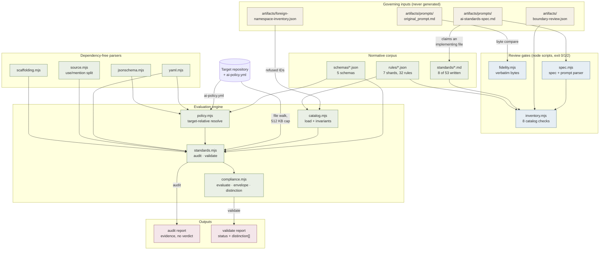
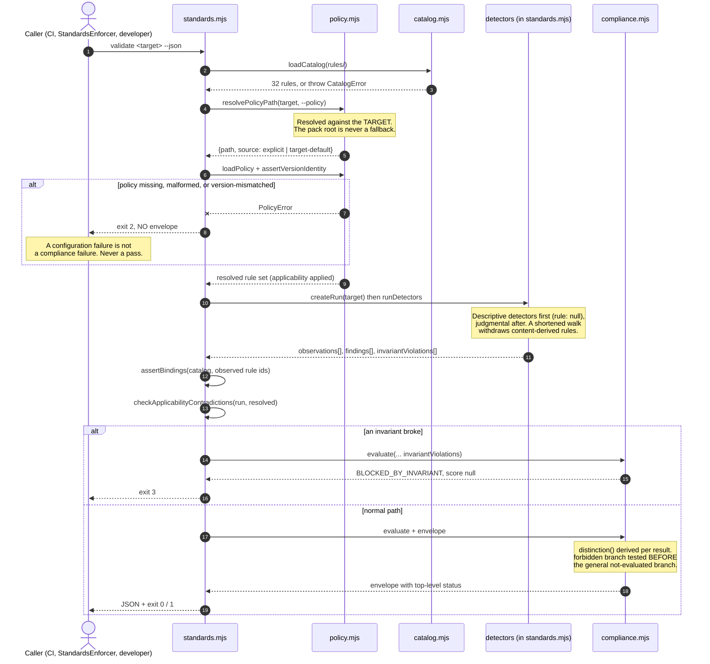

# Architecture — AIStandards

> AIStandards is a standards pack: a corpus of numbered, normative AI engineering standards, plus a
> zero-dependency Node CLI that reads a *target* repository and reports what it can and cannot
> establish about that repository's conformance. It is used by engineers adopting the standards in
> their own repositories, and — from Phase 7 — by StandardsEnforcer, which runs the CLI and reads
> the top-level `status` key of its JSON. Its defining design constraint is negative: no mechanism
> in it may convert absent evidence into a pass.

**Provenance of this document.** Generated by the `codebase-docs` skill on 2026-09-06 against
commit `70832f4`, by reading the files it names. It describes the implementation that exists at that
commit — 12 modules, 8 of 53 standards, 32 of a planned ~96 rules. It is **not** a plan and does not
describe Phases 3–7. The superseded pre-implementation capture is preserved separately as
`docs/architecture-baseline-2026-09-03.md`, which must not be overwritten: it is the evidence that
nothing pre-existed the build.

`docs/architecture.mmd` and `docs/validate-flow.mmd` are the canonical diagram sources. The fenced
blocks below are byte-identical copies. Regenerate this document rather than hand-patching it.

---

## Tech Stack

| Layer | Technology |
|---|---|
| Runtime | Node.js ≥ 18 (`engines` in `package.json`), ESM `.mjs` throughout |
| Dependencies | **None.** No `dependencies` key, no `devDependencies`, no lockfile — structurally enforced by `test/no-phase-creep.test.mjs` |
| Test framework | `node:test` + `node:assert/strict`, run via `scripts/test.mjs` with an explicit file list |
| YAML | `scripts/yaml.mjs` — a hand-written subset parser that *refuses* constructs it cannot represent rather than guessing |
| JSON Schema | `scripts/jsonschema.mjs` — a hand-written Draft-07 subset validator |
| Normative corpus | Markdown (`standards/`), JSON rule shards (`rules/`), JSON Schema (`schemas/`) |
| Distribution | `bin` entry `standards` → `scripts/standards.mjs` |

The zero-dependency rule is not a preference. A standards pack that installs code from a registry
during its own CI cannot claim to have verified committed content, and a lockfile would make that
failure quiet. Its absence is asserted by a test, so adding one breaks the build.

## Runtime Processes

There is one process. AIStandards has no server, no daemon, and no background work.

### `standards` CLI
**Host:** invoked directly by a developer, by `npm run` scripts, by CI, or by StandardsEnforcer as a
subprocess.
**Entry point:** `scripts/standards.mjs` (725 lines); `main(argv)` at line 675, dispatched from the
`import.meta.url` guard at the foot of the file.
**Purpose:** Walks a target repository, runs a fixed sequence of detectors over it, and emits either
an evidence report (`audit`) or a policy-aware verdict (`validate`). It reads the target's own
`ai-policy.yml`; it never falls back to this checkout's policy.

Three further executables are gates rather than products, each with its own `main()` and exit codes:
`scripts/fidelity.mjs` (94 lines), `scripts/inventory.mjs` (385 lines), `scripts/test.mjs` (83 lines).

## Background Jobs

**None.** There are no schedulers, workers, queues, pollers, or cron definitions anywhere in the
repository. Every code path in AIStandards runs synchronously inside one CLI invocation and exits.

## Commands

AIStandards exposes no HTTP surface. Its public interface is the CLI, and this table is the
equivalent of an endpoint inventory.

### `scripts/standards.mjs`
| Command | Flags | Purpose |
|---|---|---|
| `audit <path>` | `--json` | Evidence discovery. Prints the file surface, the detected AI surface, and all findings. Emits **no status and no score**, and prints the literal line `This is evidence, not a verdict.` (`NOT_A_VERDICT`, line 518) |
| `validate <path>` | `--policy=`, `--json` | The policy-aware verdict. Loads the target's `ai-policy.yml`, applies applicability, runs the same detectors, and emits an envelope whose top-level `status` is one of five values |

**Exit codes** (`scripts/standards.mjs:32-35`) are process semantics only and are never a verdict:
`0` clean · `1` a project-level failure (`NON_COMPLIANT` or `NOT_EVALUATED`) · `2` a *configuration*
error — missing policy, bad flags, version mismatch · `3` a structural integrity breach
(`BLOCKED_BY_INVARIANT`).

The `2`/`1` split is load-bearing: a broken setup must not be readable as a broken project.

### Gate scripts
| Command | Exit 0 | Exit 1 | Exit 2 |
|---|---|---|---|
| `node scripts/fidelity.mjs` | every verbatim block matches the brief byte-for-byte | a block does not match | **zero blocks declared** — a check with nothing to check is a configuration error, not a pass |
| `node scripts/inventory.mjs` | all 8 catalog checks ran and passed | a check found a defect | a check could not run |
| `node scripts/test.mjs` | all files passed | a test failed | **zero discovered files** |

The zero-work-is-exit-2 rule appears in all three, for the same reason each time: an empty run and a
clean run are indistinguishable in stdout, so they must be distinguishable in the exit code.

## Database

**None.** AIStandards has no database, no ORM, no migrations, and no persistent state of any kind.
Every input is a file in the repository or in the target being examined.

## External Integrations

| System | Purpose | How connected |
|---|---|---|
| StandardsEnforcer | Reads AIStandards' verdict for a governed repository | **Not yet connected.** The adapter (`standards-adapter.json`) is Phase 5 and does not exist at this commit. The enforcer would run `validate --json` as a subprocess and parse the top-level `status` key — never the exit code |
| MachineLearningStandards | Owns reproducibility, dataset provenance, evaluation and drift | Referenced by `artifacts/boundary-review.json` and by standards' Scope sections. No code dependency. The planned in-band expression (`boundary.ml-pack-required`) is not implemented |
| EngineeringStandards | Semantic crosswalk precedent for 5 catalog items | `artifacts/foreign-namespace-inventory.json` pins its rule IDs so `catalog.mjs` can *refuse* them. Crosswalking is semantic; ID reuse is a load failure |

There are no network calls anywhere in the codebase. The pack never contacts a model provider, a
registry, or any remote host — including during its own tests.

## Layers & Components

### Entry layer — the CLI
**Responsibility:** argument parsing, the detector sequence, and the two command bodies.

- `scripts/standards.mjs` — the only executable that examines a target. Holds `collectFiles()`
  (line 62, with the `SKIP` map and a 512 KB per-file cap in `MAX_BYTES`), `readText()` (line 101,
  returning `{ok, text, truncated, bytes}` so a failed read and an empty file are distinguishable),
  `createRun()` (line 142, the single mutable run object with its three writers `addFinding`,
  `observe`, `breakInvariant`), the twelve detectors, `runDetectors()` (line 490, a fixed commented
  sequence, not a registry), `commandAudit()` (line 520), `commandValidate()` (line 569) and
  `parseArgs()` (line 661). Exports `EVALUATED_RULES`, `main`, `distinction`, `DISPOSITION`.

### Catalog layer
**Responsibility:** loading the rule shards and refusing a catalog that violates its own invariants.

- `scripts/catalog.mjs` (241 lines) — `loadCatalog()` (line 163) reads `rules/*.json` and throws
  `CatalogError` on any breach. Owns `RULE_ID` (the ID regex), `VALIDATION_TYPES`, `ASSURANCE`,
  `LEVELS`, `SEVERITIES`, the 17-entry `NAMESPACES` set, `FOREIGN_NAMESPACES` (`ai`, `ai-ux` —
  refused at load, which is how ID reuse is made structurally impossible), `SHARED_SEGMENTS` (6
  segments declared as shared with other packs), `resolve()`, `assertBindings()` (line 210) and
  `coverage()` (line 225).

### Policy layer
**Responsibility:** finding, loading and applying the *target's* policy — the pack's single most
security-relevant seam.

- `scripts/policy.mjs` (146 lines) — `resolvePolicyPath()` (line 40) joins `POLICY_BASENAME`
  (`ai-policy.yml`) onto the target directory. **The pack root is never passed in as a fallback
  argument, so there is no code path in which it could be used.** `loadPolicy()` validates against
  `schemas/ai-policy.schema.json`; `assertVersionIdentity()` (line 98) refuses a policy pinned to a
  different framework version; `applyPolicy()` (line 116) applies applicability declarations.
  Every failure is `PolicyError` → exit 2.

### Judgment layer
**Responsibility:** turning observations into a verdict, and deriving the six-way distinction.

- `scripts/compliance.mjs` (288 lines) — holds **four separate vocabularies** that are never
  merged: `STATUS` (5 values), `RESULT` (4), `DISPOSITION` (5), `DISTINCTION` (6). `distinction()`
  (line 58) is a **pure derived function** of `(result, disposition, level)` — never stored, so it
  cannot drift from the vocabularies it summarises. Its branch order is load-bearing: the
  `forbidden` branch is tested *before* the general not-evaluated branch, so a prohibition nobody
  examined reports as `prohibited-but-unestablished` and never merely as `not-evaluated`.
  `evaluate()` (line 178) decides the status; `envelope()` (line 267) builds the emitted report.

### Parser layer — dependency-free
**Responsibility:** reading YAML, validating JSON Schema, and splitting source into use and mention.

- `scripts/yaml.mjs` (244 lines) — `parseYaml()` (line 123). The `REFUSED` list (line 26) names the
  constructs it will not guess at (block scalars among them); it throws `YamlError` rather than
  returning a plausible wrong value.
- `scripts/jsonschema.mjs` (254 lines) — `validate()` (line 78) and `assertValid()` (line 249).
- `scripts/source.mjs` (158 lines) — `splitSource()` (line 52) performs the **USE/MENTION split**,
  selecting comment syntax by extension from `SYNTAX` (line 14). This is what stops a repository
  that *discusses* jailbreaks, floating aliases or disabled safety flags in prose from being
  reported as *using* them. `//` is floor division in Python, and the table knows it.
- `scripts/scaffolding.mjs` (73 lines) — `SCAFFOLD_MARKER` (`$scaffold`), `isPlaceholder()` and
  `inspectScaffolding()`. Exists from Phase 1, not retrofitted, so generated placeholder content
  can never satisfy a rule.

### Specification layer
**Responsibility:** parsing the derived specification and the brief, so the review gates can compare
them.

- `scripts/spec.mjs` (206 lines) — `readSpec()`, `readPrompt()`, `readBoundaryReview()`,
  `verbatimBlocks()` (line 72), `parseSpec()` (line 130), `additionsSection()` (line 199). Owns
  `CLASSES` (`D` derived / `V` verbatim / `A` authored), `POSTURES` (`O`/`B`/`X`/`D`),
  `ADDITIONS_HEADING`, and `normalizeEol` — the **single declared normalization** (CRLF→LF on both
  sides) used for verbatim comparison, with raw-byte matches reported separately.

### Gate layer
**Responsibility:** the checks that make the 53-item catalog approved content rather than a proposal.

- `scripts/fidelity.mjs` — byte-compares every class-V block against the brief. Its header states
  plainly what it *cannot* establish: that the quoted block is the right block, that an unquoted
  passage is honoured, or that any standard written under a block says what the block requires. It
  compares bytes.
- `scripts/inventory.mjs` — eight checks: `checkNumbering` (42), `checkDerivation` (59),
  `checkAuthoredDeclarations` (96), `checkProhibitionsNameTheirPositive` (126),
  `checkImplementations` (152), `checkBoundary` (223), `checkRuleBindings` (290). A check that could
  not run is reported as withdrawn and is explicitly **not** a pass (line 347).

## Data Flow

An end-to-end `validate` run, naming the real functions:

1. `main(argv)` (`scripts/standards.mjs:675`) parses flags via `parseArgs()` and dispatches to
   `commandValidate(target, flags)` (line 569).
2. `loadCatalog()` (`catalog.mjs:163`) reads all seven `rules/*.json` shards, checks every catalog
   invariant, and throws `CatalogError` on breach.
3. `resolvePolicyPath(target, flags.policy)` (`policy.mjs:40`) produces
   `{path, source: "explicit" | "target-default"}` — resolved **against the target**.
4. `loadPolicy()` parses the YAML through `parseYaml()` and validates it against
   `schemas/ai-policy.schema.json` through `assertValid()`. `assertVersionIdentity()` then refuses a
   version mismatch. **Any failure here returns exit 2 and emits no envelope at all.**
5. `applyPolicy(catalog, policy)` (`policy.mjs:116`) produces the resolved rule set with the
   project's applicability declarations applied.
6. `createRun(target)` (line 142) calls `collectFiles()`, which walks the tree honouring `SKIP` and
   `MAX_BYTES` and records the evidence surface — including which directories the *framework*
   excluded, which is the only exclusion class that invalidates completeness.
7. `runDetectors(run)` (line 490) runs the four descriptive detectors first (they emit findings with
   `rule: null`, because binding an observation to a rule would manufacture a verdict), then the
   five full-assurance judgmental detectors, then the three partial-assurance ones. If the walk was
   shortened, `withdrawn` is true and the content-derived detectors withdraw rather than report clean.
8. `assertBindings(catalog, observedIds)` fails the run if a detector observed a rule the catalog
   does not contain.
9. `checkApplicabilityContradictions(run, resolved)` (line 472) raises
   `invariant.applicability-contradicted` when the policy declares a rule not-applicable while the
   detectors found its subject present.
10. `evaluate({resolved, observations, evaluatedRules: EVALUATED_RULES, invariantViolations})`
    (`compliance.mjs:178`) decides the status. Invariant violations win first and force `score: null`.
11. `envelope()` (`compliance.mjs:267`) builds the report, computing `distinction` per result and
    populating `unestablishedProhibitions`, `notEvaluable` and `frameworkCoverage` — all of which
    sit *outside* `status` and `denominator`.
12. `commandValidate` prints JSON or a human summary and maps the status to an exit code.

**Failure path:** steps 3–4 are the FinancialStandards trap this design exists to avoid — a pack
resolving policy against its own checkout, labelling the report with its own name, and exiting 0. A
missing policy is exit 2 with no envelope, and `test/policy-resolution.test.mjs` asserts the emitted
`project` is the fixture's name and not `AIStandards`.

## Key Patterns & Conventions

- **Four vocabularies, never merged.** `STATUS`, `RESULT`, `DISPOSITION`, `DISTINCTION` in
  `compliance.mjs:14-45`. Collapsing any two would destroy a distinction the brief requires.
- **Derived, never stored.** `distinction()` (`compliance.mjs:58`) is a pure function. The canonical
  example of the repo's preference for deriving a presentation field over persisting a fifth
  vocabulary that could drift.
- **A run that checked nothing is not a run that passed.** Zero-work is exit 2 in `fidelity.mjs`,
  `inventory.mjs` and `test.mjs`. See `scripts/fidelity.mjs:24-32` for the canonical comment.
- **Withdraw, never report clean.** When the evidence walk is shortened, content-derived rules are
  withdrawn to not-evaluated (`standards.mjs:506`). `CONTENT_DERIVED_RULES` (line 121) is the list.
- **Descriptive before judgmental, `rule: null` on the descriptive ones.** `runDetectors()` line 490.
- **Foreign namespaces are refused, not merely avoided.** `FOREIGN_NAMESPACES` in `catalog.mjs:50`
  makes ES/UIUX ID reuse a catalog load failure rather than a convention someone might break.
- **Parsers refuse rather than guess.** `yaml.mjs`'s `REFUSED` list (line 26).
- **Use/mention split.** `source.mjs:52`. Discussion of a hazard is never a finding.
- **Explicit test file list, no globs.** `scripts/test.mjs:21` — a glob matching nothing looks
  exactly like a suite that passed.
- **`--test-concurrency=1` is mandatory.** The mutation suites corrupt and restore shared real
  files; running them in parallel corrupts the run.

## Entry Points for Common Tasks

| Task | Where to start |
|---|---|
| Add a standard | `standards/NN-kebab-case.md`, ten H2s in the order fixed by `standards/06-standard-structure-and-rule-identity.md`; claim it in the `Implemented by` column of the item's row in `artifacts/prompts/ai-standards-spec.md`; add the filename to the list in `test/no-phase-creep.test.mjs` |
| Add a rule | The matching `rules/*.json` shard. The ID must match `RULE_ID` in `catalog.mjs:30` and its namespace must be in `NAMESPACES` (line 43) |
| Add a rule namespace | `NAMESPACES` in `scripts/catalog.mjs:43`, and `docs/` boundary notes if it touches another pack |
| Add a detector | `scripts/standards.mjs` — write the function, insert it into `runDetectors()` (line 490) in the correct band, and add its rule ID to `EVALUATED_RULES` (line 130). A test asserts the two agree in both directions |
| Add a schema | `schemas/*.json`, registered in the `SCHEMAS` map at `scripts/standards.mjs:40` |
| Add a test | Write `test/<name>.test.mjs` **and** add it to the explicit `FILES` list in `scripts/test.mjs:21` — it will not be discovered otherwise |
| Add a fixture | `test/fixtures/<name>/`. Judgmental detectors need a provoking **and** a non-provoking pair |
| Change the brief's quoted text | You cannot. `artifacts/prompts/original_prompt.md` is never edited; `fidelity.mjs` compares against it |

## Module Graph

| Module | Lines | Responsibility | Imports (internal) |
|---|---|---|---|
| `scripts/standards.mjs` | 725 | CLI, file walk, detectors, both commands | catalog, policy, compliance, yaml, jsonschema, source, scaffolding |
| `scripts/inventory.mjs` | 385 | Eight catalog review checks | spec, catalog |
| `scripts/compliance.mjs` | 288 | Vocabularies, `distinction`, `evaluate`, `envelope` | — |
| `scripts/jsonschema.mjs` | 254 | Draft-07 subset validator | — |
| `scripts/yaml.mjs` | 244 | YAML subset parser that refuses what it cannot represent | — |
| `scripts/catalog.mjs` | 241 | Rule loading and catalog invariants | — |
| `scripts/spec.mjs` | 206 | Specification and brief parsing | — |
| `scripts/source.mjs` | 158 | Use/mention split | — |
| `scripts/policy.mjs` | 146 | Target-relative policy resolution | yaml, jsonschema |
| `scripts/fidelity.mjs` | 94 | Verbatim byte comparison gate | spec |
| `scripts/test.mjs` | 83 | Explicit-list test runner | — |
| `scripts/scaffolding.mjs` | 73 | Placeholder detection | — |

`compliance.mjs`, `catalog.mjs`, `yaml.mjs`, `jsonschema.mjs`, `source.mjs` and `scaffolding.mjs`
have no internal imports at all, which is why they are unit-testable without spawning the CLI.

## Diagram — structure

## Diagram — the `validate` flow

**SVG was not generated.** `npx -y @mermaid-js/mermaid-cli` would download a package and a headless
browser at build time. This repository has no dependencies, no lockfile, and a test asserting that
remains true, so no render step exists. The `.mmd` files are the canonical source and the fenced
blocks above render natively wherever this document is read. A hand-drawn SVG was not substituted.

## Gaps — where the code is genuinely unclear or absent

These are recorded rather than guessed at, per the brief's requirement to preserve uncertainty.

| Gap | State |
|---|---|
| `standards-adapter.json` | Does not exist. Phase 5. Until it does, nothing observable connects this pack to StandardsEnforcer |
| Detector coverage | 9 of 32 rules are in `EVALUATED_RULES`. The other 23 report `skipped / not-evaluated` by construction. This is the honest floor, not an omission |
| `boundary.ml-pack-required` | Planned in-band expression of the MachineLearningStandards dependency. Not implemented, and unilateral until ML's maintainers accept it |
| Attestations, `init`, templates, containers, workflows | Phases 4–6. No code exists |
| `artifacts/boundary-review.json` | `humanSignOff` is `null` and 3 items are `unresolved`. Every posture is a unilateral judgment; no adjacent pack's maintainers have confirmed any of it |
| `core.autocrlf` | `true`, with no `.gitattributes`. Committed bytes are LF, working-tree bytes CRLF. Harmless for `fidelity.mjs`, which declares a CRLF→LF normalization on both sides, but unpinned |
