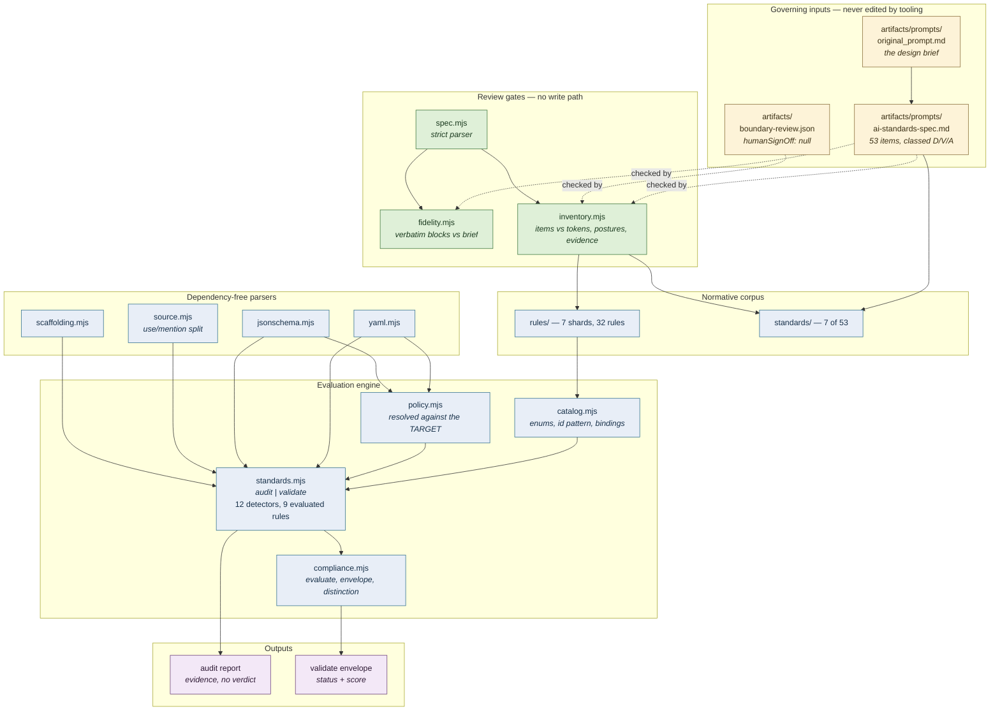

# Architecture — AIStandards

> **Captured 2026-09-04, against the implementation that exists on this date.** It supersedes
> [`docs/architecture-baseline-2026-09-03.md`](architecture-baseline-2026-09-03.md), which recorded
> a repository with no implementation at all. The baseline is kept rather than overwritten: it is
> the evidence that nothing pre-existed, and this document is not evidence about it.
>
> **Provenance of this document, stated because it matters.** The plan schedules `/codebase-docs` to
> produce this file and forbids hand-authoring it. That skill is **not available in the session that
> wrote this** — it is not among the enabled skills and a skill search for it returns nothing. This
> document was therefore produced by reading the repository directly: every file listed was
> enumerated on disk, every count was computed rather than recalled, and every command shown was
> executed. That is a weaker provenance than a generated artifact, because nothing mechanically
> re-derives it, and it is recorded here rather than left for a reader to assume. **Regenerate with
> `/codebase-docs` when it is available; do not hand-patch this file in the meantime.**

## Status

| Question | Answer on 2026-09-04 |
|---|---|
| Does an implementation exist? | **Yes.** A working CLI with two commands |
| Source files | 12 `.mjs` under `scripts/`, 2 897 lines |
| Build | None, by design. No compile step, no bundler |
| Dependencies | **Zero third-party.** `package.json` has no `dependencies` key and there is no lockfile |
| Tests | 17 files, 225 assertions, `node:test` only |
| CI | **None yet.** Phase 5. There is no workflow, no Dockerfile, no `compose.ci.yml` |
| Deployment | **None.** This is a library and CLI, not a service |
| Runtime processes | **None.** `standards.mjs` runs, prints, and exits |
| Background jobs | **None** |
| API endpoints | **None** |
| Database | **None** |
| External integrations | **None at runtime.** It reads adjacent repositories' rule ids only as a checked-in snapshot, never live |
| Network access | **None.** No `fetch`, no `http`, no provider SDK |

## What runs, and how

Two commands, and the split between them is the load-bearing architectural decision.

```bash
node scripts/standards.mjs audit <dir> [--json] [--strict]
```

```bash
node scripts/standards.mjs validate <dir> [--policy=<path>] [--json]
```

`audit` discovers evidence and prints **"This is evidence, not a verdict."** It emits no `status` and
no `score`. `validate` is the policy-aware verdict. A repository can be audited without a policy; it
cannot be validated without one, and a missing or malformed policy is **exit 2**, never a pass.

Exit codes are process semantics only: `0` clean, `1` finding or failure, `2` configuration error,
`3` blocked by invariant. Nothing reads them as a verdict — StandardsEnforcer reads the top-level
`status` key of the JSON envelope, and that contract is why the codes are kept separate.

## Module graph

`scripts/` is a flat directory of ES modules with no third-party import anywhere. Verified:
`grep -rn 'from "[^.]' scripts/ | grep -v 'node:'` returns nothing but a comment.

| Module | Lines | Responsibility | Imports |
|---|---|---|---|
| `standards.mjs` | 725 | The CLI. Both commands, all 12 detectors, the evidence walk | catalog, policy, compliance, source, scaffolding, yaml, jsonschema |
| `compliance.mjs` | 288 | `evaluate()`, `envelope()`, `distinction()`. The four vocabularies | — |
| `jsonschema.mjs` | 254 | Draft-subset validator, written here because there is no dependency budget | — |
| `yaml.mjs` | 244 | YAML subset parser. Refuses block scalars rather than guessing | — |
| `catalog.mjs` | 241 | Rule loading, enums, id pattern, `assertBindings`, namespace refusal | — |
| `inventory.mjs` | 385 | Catalog review gate. **No write path** | spec, catalog |
| `spec.mjs` | 206 | Strict parser for the specification and the boundary review | — |
| `source.mjs` | 158 | USE/MENTION split — code vs comment vs string, comment syntax by extension | — |
| `policy.mjs` | 146 | Policy resolution **against the target**, never this checkout | yaml, jsonschema |
| `fidelity.mjs` | 94 | Verbatim review gate. **No write path** | spec |
| `test.mjs` | 83 | Runner. Explicit file list, no globs | — |
| `scaffolding.mjs` | 73 | `SCAFFOLD_MARKER`, placeholder detection | — |

The graph is a shallow tree, not a web: `standards.mjs` is the only module importing more than two
others, and nothing imports `standards.mjs` except the tests, which spawn it as a subprocess rather
than importing it.

**Two modules sit outside the evaluation path entirely** — `fidelity.mjs` and `inventory.mjs` reach
the corpus only through `spec.mjs`, and neither has a code path that writes a file. They are review
gates, and that absence is asserted by test rather than left to inspection.

## The evidence path

`createRun()` walks the target and produces a run object carrying every way evidence could be lost —
excluded directories with their authorisation, truncated files, unreadable files, budget exhaustion.
`readText()` returns `{ok, text, truncated, bytes}` so that a failed read and an empty file are never
the same value.

Detectors are plain functions in a fixed commented sequence, not a plugin registry. Four are
**descriptive** and bind to no rule, because binding an observation to a rule manufactures a verdict:
`detectManifestPresence`, `detectToolPermissions`, `detectPromptAssets`, `detectToolDefinitions`.
Eight are **judgmental** and bind: `detectMissingManifest`, `detectInvalidManifest`,
`detectScaffoldManifest`, `detectMissingToolPermissions`, `detectUndeclaredTool`,
`detectFloatingModelAlias`, `detectInlineSystemPrompt`, `detectDisabledSafetyControls`.

`EVALUATED_RULES` names the 9 rules a detector can actually reach. The other 23 report
`skipped / not-evaluated`, and every `forbidden` one among them reports
`prohibited-but-unestablished`. `assertBindings()` fails if those two sets disagree in either
direction — a rule listed with no detector, or a detector bound to a rule not listed.

## The corpus

| Directory | Contents |
|---|---|
| `rules/` | 7 shards, **32 rules**: `lifecycle` 6, `gate` 6, `eval` 5, `privacy` 5, `promptsec` 5, `agent` 4, `misuse` 1 |
| `standards/` | **7 of 53**: 01, 03, 05, 06, 07, 21, 45 |
| `schemas/` | 5: ai-policy, ai-system-manifest, tool-permissions, audit-report, validate-report |

The seven standards are the five machinery documents for what Phase 1's code does, plus the
deliberately easiest and hardest domain standards, so the document skeleton is proven at both
extremes before the remaining 46 are written.

**Not present, and their absence is the honest state rather than an omission:** `templates/`,
`init.mjs`, `manifest.mjs`, `toolperms.mjs`, `sync-rule-tables.mjs`, `attestations.mjs`,
`adapter.mjs`, `pipeline.mjs`, `standards-adapter.json`, `ci/`, `.github/workflows/`, `design/`,
`artifacts/adr/`. `test/no-phase-creep.test.mjs` asserts each is absent, so a later phase cannot
arrive early by accident.

## The review gates

Two commands gate the catalog's identity, and neither can write anything.

```bash
node scripts/fidelity.mjs
```

```bash
node scripts/inventory.mjs
```

`fidelity.mjs` compares the specification's four `verbatim` fences to
`artifacts/prompts/original_prompt.md`. **One normalization is applied, and it is declared in both
the code and the specification:** CRLF→LF on both sides, because the brief is stored CRLF with no
`.gitattributes` and a raw byte comparison would fail on another platform for a reason unrelated to
fidelity. The raw-byte match count is reported separately so the normalization hides nothing.

`inventory.mjs` runs 15 checks and reports 47 as **NOT EVALUATED**, because 46 standards do not exist
yet. That count prints under a heading saying *none of these is a pass*, which is the whole design: a
check that could not run must never look like one that succeeded.

## Testing

`scripts/test.mjs` runs an **explicit file list, no globs** — a glob matching nothing looks exactly
like a suite that passed, and zero discovered files is exit 2.

It runs at **`--test-concurrency=1`**, and this is not a preference. `fidelity.test.mjs` and
`inventory.test.mjs` are mutation suites: each corrupts a real file on disk, asserts the specific
failure, and restores it. Two of those in parallel overwrite each other's restore, and the symptom is
a test failing for a reason unrelated to what it asserts, plus a corrupted file left behind. That
happened during development, and it is why the flag is there.

Every judgmental detector is asserted twice — once on a fixture that must provoke it and once on a
fixture that must not. `test/fixtures/mentions-only/` is the negative control that matters most: a
repository discussing jailbreaks, floating aliases and disabled safety flags in prose and comments
only, which must produce zero findings.

## Diagram

[`docs/architecture.mmd`](architecture.mmd) is the canonical source; the block below is
byte-identical to it.



No `.svg` was rendered and none should be: the embedded block renders natively, and fetching a
renderer would put a network dependency into a repository that has none. No `sequenceDiagram` is
included — the CLI is a single synchronous pass, with no request flow to describe.

## Gaps and ambiguities

**Arising from the code:** none that reading it does not resolve. The modules are small, the graph is
shallow, and every enum is declared in exactly one place.

**Arising from what the code cannot establish, which is the more important list:**

- The evaluation engine reads repositories and never models. Every requirement whose subject is model
  behaviour at inference time is `not-evaluable` by construction, and no amount of further
  implementation changes that.
- 23 of 32 rules have no detector. They report as not-evaluated, correctly — but a reader scanning a
  mostly-`NOT_EVALUATED` report may read a working tool as a broken one.
- The boundary with nine adjacent packs is recorded as dated observations at pinned commits. Nothing
  in this repository notices when one of those scopes is amended.

## Regeneration

Regenerate this document rather than patching it. It will be materially wrong when Phase 2's
remaining 46 standards land, again when Phase 3's detectors land, and again when Phase 5 adds CI and
the adapter — which is the first point at which "deployment: none" stops being the whole truth.

Three captures now exist or are scheduled: the 2026-09-03 baseline recording that nothing
pre-existed, this one recording Phase 1 plus the Phase 2 review gates, and the Phase 5 capture the
plan schedules. None is evidence about the others.
